# Claims Analyst Agent

AI-powered healthcare claims fraud detection system. Combines statistical anomaly detection, a provider/beneficiary/DRG knowledge graph, and LLM-powered multi-hypothesis reasoning to produce structured Finding Cards for auditors.

See [PRODUCT.md](./PRODUCT.md) for the product vision, users, and principles.

## Architecture

```
claims-analyst/
├── packages/
│   ├── shared/          # Types, constants (DRG codes, regions, signal schemas)
│   ├── data/            # ETL → SQLite via drizzle-orm, seed CSVs, baseline stats
│   ├── graph/           # Kuzu schema, graph seeding, Cypher queries
│   ├── agents/          # Signal pipeline, reasoning agent, sub-agent definitions
│   └── dashboard/       # Next.js + Tailwind + OpenRouter chat
├── turbo.json
└── package.json
```

## Data Flow

```mermaid
flowchart LR
    subgraph Input
        CSV[Seed CSVs]
    end

    subgraph Data["packages/data"]
        ETL[ETL Pipeline]
        SQLite[(SQLite)]
        BL[Baselines]
    end

    subgraph Graph["packages/graph"]
        Kuzu[(Kuzu Graph)]
    end

    subgraph Agents["packages/agents"]
        SE[Signal Engine]
        GR[Heuristic Grouper]
        EN[Graph Enricher]
        RA[Reasoning Agent]
        SA[Sub-Agents]
        SYN[Synthesizer]
    end

    subgraph Dashboard["packages/dashboard"]
        API[API Routes]
        UI[Signal Feed]
        Chat[Chat Panel]
    end

    CSV -->|ingest| ETL
    ETL --> SQLite
    SQLite -->|compute stats| BL
    SQLite -->|seed nodes/edges| Kuzu
    BL -->|z-score thresholds| SE
    SE -->|signals| GR
    GR -->|clusters| EN
    Kuzu -->|subgraph context| EN
    EN -->|enriched clusters| RA
    RA -->|hypotheses| SA
    SA -->|scored verdicts| SYN
    SYN -->|finding cards| API
    API -->|JSON| UI
    API -->|context| Chat
    Chat -->|OpenRouter| LLM[(DeepSeek V4 Pro)]
    LLM -->|response| Chat
```



## Agent Pipeline Detail

```mermaid
flowchart TD
    BL[Provider Baselines<br/>DRG distribution, readmission rates] --> SE
    RB[Region Baselines<br/>ER volume, WoW change] --> SE

    SE[Statistical Rule Engine<br/>z-score thresholds: &#124;z&#124; > 2.0] --> GR
    GR[Heuristic Grouper<br/>clusters by provider + DRG family] --> EN

    EN[Graph Enricher<br/>peer providers, DRG hierarchy,<br/>KPI influences, hypothesis edges] --> RA

    RA[Reasoning Agent<br/>generates hypotheses from graph,<br/>spawns sub-agents] --> SA

    SA["Sub-Agents (parallel)<br/>each tests one hypothesis<br/>with focused data context"] --> SYN

    SYN[Synthesizer<br/>collates verdicts → Finding Card<br/>severity, evidence path, recommendation]
```



## Three Seeded Scenarios

| Scenario | Provider | Pattern | Signal |
|----------|----------|---------|--------|
| **Upcoding** | PROV_B (NY) | Bills high-cost DRGs while peers bill lower | z-score on MCC-tier DRG rates vs peers |
| **Readmission Spiral** | PROV_D (TX) | 2x readmission rate vs peers | 30-day readmission rate z-score |
| **Geographic Spike** | PROV_E (FL) / South | ER visit volume explosion | WoW change + volume z-score on regional ER visits |

## Quick Start

### Prerequisites

- Node.js 22+
- pnpm 10+

### Install

```bash
pnpm install
```

### Run the Pipeline

```bash
# Full pipeline: seed CSVs → SQLite → graph → signals → finding cards
pnpm exec tsx packages/agents/src/run-pipeline.ts

# Output findings as JSON for the dashboard
pnpm exec tsx packages/agents/src/run-pipeline.ts --output=packages/dashboard/data/findings.json
```

### Run the Dashboard

```bash
pnpm --filter @claims-analyst/dashboard dev
```

Opens at `http://localhost:3000`.

**First run**: generate the findings JSON first (see above), then start the dev server.

**Subsequent runs**: the `prebuild` script auto-generates findings on `pnpm --filter @claims-analyst/dashboard run build`. During dev, regenerate manually with the `--output` command above whenever you change seed data.

### Test

```bash
# All packages
pnpm run test

# Individual packages
pnpm --filter @claims-analyst/data run test
pnpm --filter @claims-analyst/graph run test
pnpm --filter @claims-analyst/agents run test
```

## Tech Stack

| Layer | Technology |
|-------|-----------|
| Monorepo | Turborepo + pnpm workspaces |
| Frontend | Next.js 16 (App Router), Tailwind v4, React 19 |
| AI Chat | Vercel AI SDK + OpenRouter (DeepSeek V4 Pro) |
| Data | better-sqlite3 + drizzle-orm, CSV seed data |
| Graph | Kuzu 0.11.3 (embedded, Cypher) |
| Stats | pond-ts + als-statistics |
| Types | TypeScript, Zod schemas |
